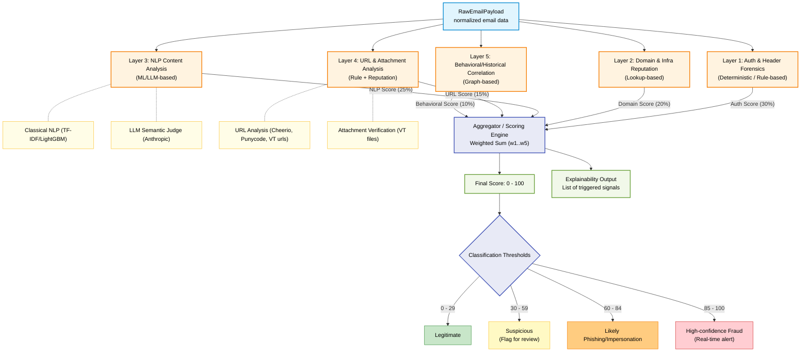

# MailForensix Analysis Engine Data Flow Diagram

Here is the data flow diagram visualizing the multi-layer analysis pipeline and scoring engine described in your framework document.

```mermaid
graph TD
    classDef input fill:#e1f5fe,stroke:#0288d1,stroke-width:2px,color:#000
    classDef layer fill:#fff3e0,stroke:#f57c00,stroke-width:2px,color:#000
    classDef sublayer fill:#fffde7,stroke:#fbc02d,stroke-width:1px,color:#000
    classDef aggregate fill:#e8eaf6,stroke:#3f51b5,stroke-width:2px,color:#000
    classDef output fill:#f1f8e9,stroke:#689f38,stroke-width:2px,color:#000
    classDef legit fill:#c8e6c9,stroke:#388e3c,color:#000
    classDef suspicious fill:#fff9c4,stroke:#fbc02d,color:#000
    classDef phishing fill:#ffcc80,stroke:#f57c00,color:#000
    classDef fraud fill:#ffcdd2,stroke:#d32f2f,color:#000

    RawEmail[RawEmailPayload<br/>normalized email data]:::input

    %% Layers
    L1["Layer 1: Auth & Header Forensics<br/>(Deterministic / Rule-based)"]:::layer
    L2["Layer 2: Domain & Infra Reputation<br/>(Lookup-based)"]:::layer
    L3["Layer 3: NLP Content Analysis<br/>(ML/LLM-based)"]:::layer
    L4["Layer 4: URL & Attachment Analysis<br/>(Rule + Reputation)"]:::layer
    L5["Layer 5: Behavioral/Historical Correlation<br/>(Graph-based)"]:::layer

    RawEmail --> L1
    RawEmail --> L2
    RawEmail --> L3
    RawEmail --> L4
    RawEmail --> L5

    %% Layer Details
    L3_1["Classical NLP (TF-IDF/LightGBM)"]:::sublayer
    L3_2["LLM Semantic Judge (Anthropic)"]:::sublayer
    L3 -.- L3_1
    L3 -.- L3_2

    L4_1["URL Analysis (Cheerio, Punycode, VT urls)"]:::sublayer
    L4_2["Attachment Verification (VT files)"]:::sublayer
    L4 -.- L4_1
    L4 -.- L4_2

    %% Aggregation
    Aggregator["Aggregator / Scoring Engine<br/>Weighted Sum (w1..w5)"]:::aggregate

    L1 -->|"Auth Score (30%)"| Aggregator
    L2 -->|"Domain Score (20%)"| Aggregator
    L3 -->|"NLP Score (25%)"| Aggregator
    L4 -->|"URL Score (15%)"| Aggregator
    L5 -->|"Behavioral Score (10%)"| Aggregator

    FinalScore[Final Score: 0 - 100]:::output
    Explanation[Explainability Output<br/>List of triggered signals]:::output
    
    Aggregator --> FinalScore
    Aggregator --> Explanation

    %% Classification
    Classifier{"Classification Thresholds"}:::aggregate
    FinalScore --> Classifier

    Classifier -->|"0 - 29"| Legitimate["Legitimate"]:::legit
    Classifier -->|"30 - 59"| Suspicious["Suspicious<br/>(Flag for review)"]:::suspicious
    Classifier -->|"60 - 84"| Phishing["Likely Phishing/Impersonation"]:::phishing
    Classifier -->|"85 - 100"| Fraud["High-confidence Fraud<br/>(Real-time alert)"]:::fraud

```
